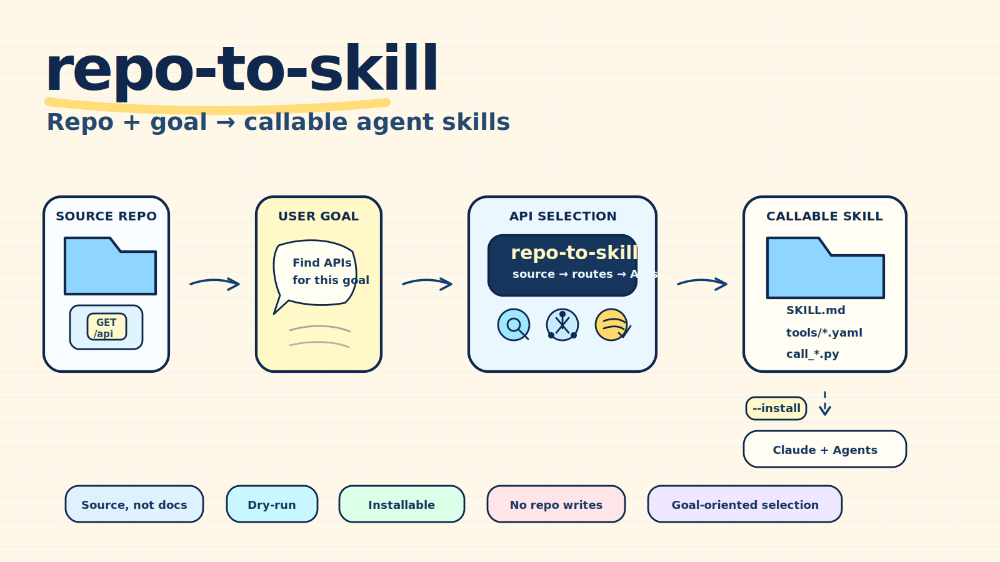

# starry-agent

[English](README.md) | [简体中文](README.zh-CN.md)

**A personal monorepo for agent skills, tools, and products.**

`starry-agent` collects agent-facing artifacts I (the author) build: callable skills, the tools that generate or support them, and standalone agent products. Each artifact lives in its own subdirectory and can be used independently.

| Path | Kind | Description |
|------|------|-------------|
| [`skills/repo-to-skill/`](skills/repo-to-skill/) | Skill | The skill that wraps the `repo-to-skill` CLI for agent invocation. |
| [`repo_to_skill/`](repo_to_skill/) + [`pyproject.toml`](pyproject.toml) | Tool + library | The `repo-to-skill` CLI: turn a local repo and a goal into installable callable skills. |
| [`docs/`](docs/) | Docs | Bilingual how-it-works, skill reference, architecture, security. |

Future additions will appear as new top-level subdirectories (for example a standalone agent product under `agents/<name>/`).

---

## repo-to-skill

**Give it a repo and a user goal. It finds the right APIs and turns them into callable agent skills.**



repo-to-skill helps coding agents reuse existing software instead of reimplementing it. It reads a local repository **from source — no API docs or OpenAPI spec required**, detects callable HTTP interfaces, selects the APIs that match a user goal, and generates a separate, installable skill package with tool schemas, safe caller scripts, and source-level provenance.

- **Source, not docs** — it reverse-engineers callable interfaces from source code via static analysis, so it works on legacy systems that have no API documentation.
- **Goal-oriented** — start from a user goal, not a hand-picked API list.
- **Callable** — generated skills include tool contracts and `scripts/call_*.py` helpers for live HTTP systems.
- **Installable** — `--install` drops the generated skill into `~/.claude/skills` and `~/.agents/skills` for immediate cross-agent use.
- **Non-invasive** — it reads the target repository and writes output elsewhere; it never modifies the target repo.
- **Auditable** — every selected API is explained with route, handler, business method, field contract, score, and source reference.

## How it's different

Most ways to give an agent a new skill are either **hand-written** or generated from **API documentation / an OpenAPI spec**. repo-to-skill starts from **source code**: it statically detects the HTTP interfaces a codebase already exposes and turns the selected ones into callable skills — with every field traced back to the source. That makes it usable on exactly the systems that lack docs: older internal and enterprise services.

## Why this exists

Most organizations already have valuable behavior locked inside older systems: HR workflows, finance approvals, internal operations, customer support tools, scheduling engines, reporting endpoints, and more. Coding agents can read code, but reading code is not the same as safely reusing the live system behavior.

repo-to-skill turns those existing interfaces into callable agent skills:

```text
local repository + user goal
  -> static analysis
  -> callable API detection
  -> goal-based interface selection
  -> one focused skill bundle
  -> validated tools and dry-run callers
```

The result is not a patch to the original repository. It is a separate skill package that another agent can review, import, and call.

## What it generates

repo-to-skill can generate two kinds of skills.

### 1. Repository map skill

A read-only orientation pack for a coding agent:

- `SKILL.md` — human-readable project briefing.
- `manifest.yaml` — metadata and safety boundaries.
- `references/project-map.md` — modules, representative paths, relationships, task entry points, and validation guidance.
- `references/capability-graph.md` — capability graph.
- `references/skill-spec.md` — generated skill specification.
- `references/confidence-report.md` — evidence and verification notes.
- `scripts/inspect_repo.py` — read-only helper script.

### 2. Callable bundle skill

A goal-oriented skill that wraps selected live HTTP APIs:

- `SKILL.md` — when to use the bundle and what tools it contains.
- `manifest.yaml` — `kind: callable-bundle`, selection summary, safety boundaries.
- `tools/*.tool.yaml` — one machine-readable tool contract per selected API.
- `scripts/call_*.py` — one safe caller per selected API.
- `references/capability-selection.md` — why each API was selected for the user goal.
- `references/capability-source.md` — route, handler, business method, input fields, output fields, and source provenance.

Generated callers default to preview mode. They only send a request when the user sets the endpoint environment variable and passes `--execute`. Tokens are read from environment variables and redacted in previews.

## Quick start

Install from a source checkout:

```bash
python -m pip install -e .
repo-to-skill --help
```

Generate a callable skill bundle from a repository and a goal, then install it for immediate agent use:

```bash
repo-to-skill analyze ./my-legacy-system --output ./.runs/my-system-analysis

repo-to-skill generate ./my-legacy-system \
  --analysis ./.runs/my-system-analysis \
  --output ./.runs/my-system-skill \
  --mode callable-bundle \
  --need "employee onboarding and job transfer workflows" \
  --max-interfaces 12 \
  --install
```

With `--install`, a bundle that passes validation is copied into `~/.claude/skills/` and `~/.agents/skills/` so a coding agent can pick it up right away. Omit `--install` to only write the reviewable package under `--output`.

Or generate a read-only repository map skill:

```bash
repo-to-skill compose ./examples/tiny-python-app \
  --workdir ./.runs/tiny-python-analysis \
  --output ./.runs/tiny-python-skill
```

Validate the generated bundle:

```bash
repo-to-skill validate ./.runs/my-system-skill/<bundle-name>
```

## Agent skill workflow

repo-to-skill itself can be used as a skill-builder by a coding agent:

1. Run `analyze` on the target repository.
2. Read `callable_capabilities.json`.
3. Translate the user goal into a small set of relevant interface slugs.
4. Write a selection file:

   ```json
   {
     "need_summary": "Generate a callable skill for employee onboarding and job transfer workflows.",
     "selected_slugs": ["employee-entry", "job-transfer", "position-change"],
     "selection_source": "agentic"
   }
   ```

5. Generate a bundle from the verified selection:

   ```bash
   repo-to-skill generate ./my-legacy-system \
     --analysis ./.runs/my-system-analysis \
     --output ./.runs/my-system-skill \
     --mode callable-bundle \
     --selection-json ./.runs/selection.json
   ```

The CLI still validates every selected slug. If an agent suggests a slug that does not exist in `callable_capabilities.json`, generation fails instead of inventing a tool.

## Commands

- `doctor` checks the local Python/package environment.
- `analyze` scans a local repository and writes analysis artifacts.
- `generate` turns analysis artifacts into a skill directory.
- `validate` checks generated skill shape and safety boundaries.
- `compose` runs analyze -> generate -> validate for read-only repo map skills.
- `eval` runs deterministic local eval cases.

## Safety model

repo-to-skill does not modify the target repository. Keep analysis and skill output outside the target repository so generated artifacts never become accidental source changes.

Read-only repo map helpers do not use network access. Callable bundle helpers can call live HTTP systems, but only with explicit endpoint configuration and `--execute`. They do not install dependencies, do not spawn shell commands, and do not write to the target repository.

## Scale and limits

repo-to-skill is designed for small to large local repositories. It has been verified on a large enterprise repository with 4,459 scanned files, about 940k scanned lines, and about 569k source lines.

There is no hard total-line limit. Runtime depends on file count, disk speed, and generated content. The scanner skips binary files, symlinks, sensitive files, generated artifacts, dependency folders, local run artifacts, and individual files larger than 1 MiB.

## Compatibility

The generated package is intentionally vendor-neutral. Different coding-agent tools can read the Markdown references directly, use a command-aware adapter, or implement a native package adapter. See [Compatibility](docs/compatibility.md) and [Adapters](adapters/README.md).

## More documentation

- [How it works](docs/how-it-works.md)
- [Skill reference](docs/skill-reference.md)
- [Architecture](docs/architecture.md)
- [Security](docs/security.md)
- [Skill output format](docs/skill-output-format.md)
- [Compatibility](docs/compatibility.md)
- [Adapters](adapters/README.md)
- [Evals](docs/evals.md)

Simplified Chinese versions of how-it-works and skill reference are also available:

- [工作原理](docs/how-it-works.zh-CN.md)
- [技能详细解析](docs/skill-reference.zh-CN.md)

## License and attribution

repo-to-skill is licensed under the Apache License 2.0. You may use, modify, and distribute it under that license.

When redistributing this project or derivative works, retain `LICENSE` and `NOTICE` and include attribution to the repo-to-skill project as the original source.
