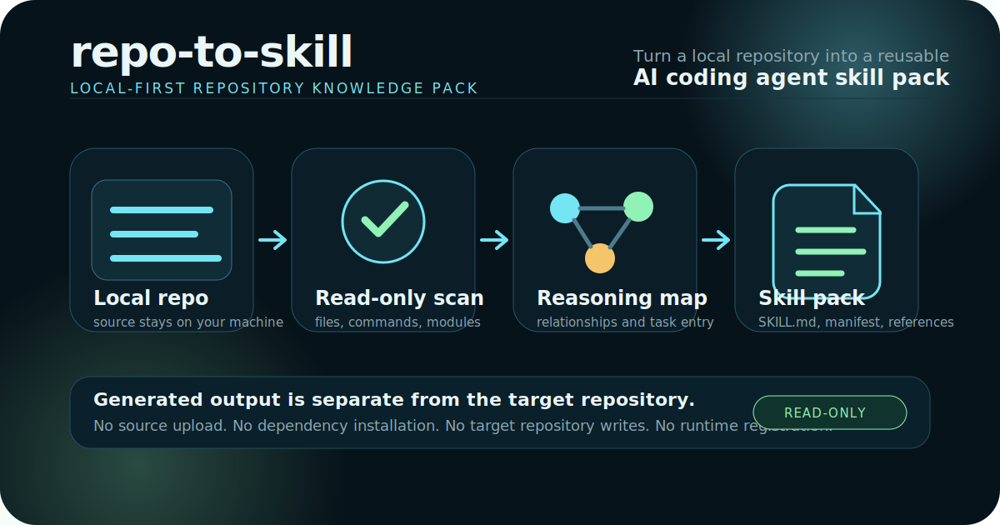

# repo-to-skill

repo-to-skill is a local-first Python CLI for turning a local code repository into a reviewable, installable, and verifiable AI coding agent skill pack.



The project is built for local scanning: it reads files from a repository on your machine, writes analysis artifacts and generated skill output to directories you choose, and does not upload source code. It does not require a remote database. It also does not use a vector database by default; a vector index may be explored later as an optional extension, but it is not an MVP dependency.

## What it generates

repo-to-skill reads a target repository without modifying it, then generates a separate skill package that an AI coding agent can review and import:

- `SKILL.md` for the human-readable project briefing.
- `manifest.yaml` for package metadata and safety boundaries.
- `references/project-map.md` for modules, representative paths, relationships, task entry points, and validation guidance.
- `references/capability-graph.md`, `references/skill-spec.md`, and `references/confidence-report.md` for evidence-backed repository capabilities.
- `scripts/inspect_repo.py` as a read-only helper that does not spawn shell commands.

## Visual demo assets

The launch video sources live in [`designs/repo-to-skill-launch`](designs/repo-to-skill-launch/). Large rendered videos are attached to GitHub Releases instead of committed directly into source history.

- [Watch the launch video](https://github.com/zhangguiping-xydt/repo-to-skill/releases/download/v0.1.0/repo-to-skill-launch.mp4)
- [Open the release page](https://github.com/zhangguiping-xydt/repo-to-skill/releases/tag/v0.1.0)

## Installation

From a source checkout:

```bash
python -m pip install -e .
repo-to-skill --help
```

For development checks:

```bash
python -m pip install -e .[dev]
python -m pytest
```

## Quick start from a source checkout

Use the packaged tiny example to see the complete local flow:

```bash
repo-to-skill doctor
repo-to-skill analyze ./examples/tiny-python-app --output ./.runs/tiny-python
repo-to-skill generate ./examples/tiny-python-app --analysis ./.runs/tiny-python --output ./.runs/tiny-python-skill
repo-to-skill validate ./.runs/tiny-python-skill
repo-to-skill compose ./examples/tiny-python-app --output ./.runs/tiny-python-composed-skill --workdir ./.runs/tiny-python-compose
repo-to-skill eval --case tiny-python
```

## Use your own repository

Keep generated analysis and skill output outside the target repository:

```bash
mkdir -p ../repo-to-skill-runs
repo-to-skill compose ../my-app \
  --workdir ../repo-to-skill-runs/my-app-analysis \
  --output ../repo-to-skill-runs/my-app-skill
repo-to-skill validate ../repo-to-skill-runs/my-app-skill
```

Review `SKILL.md`, `manifest.yaml`, and `references/confidence-report.md` before importing the generated skill pack into any AI coding agent environment.

## Commands

- `doctor` checks the local Python/package environment only.
- `analyze` performs local scanning and writes an artifact chain: `scan.json`, `profile.json`, `capability_evidence.json`, `capability_graph.json`, `skill_spec.yaml`, `verification_report.json`, and `confidence-report.md`.
- `generate` turns a complete artifact chain into a skill directory.
- `validate` checks the generated skill shape and safety boundaries.
- `compose` runs analyze -> generate -> validate locally without runtime registration.
- `eval` runs deterministic local eval cases such as the packaged `tiny-python` case, so `repo-to-skill eval --case tiny-python` works after installation. The source-tree `evals/cases` and `examples` directories remain readable examples of the packaged resources.

## Safety model

repo-to-skill does not modify the target repository. The analyze/generate output must be outside the target repository so generated artifacts never become accidental source changes.

Generated helper scripts are read-only: no network, no dependency installation, and generated helpers do not spawn shell commands. They inspect checked-in files and render human-reviewable references.

## Business SkillOps boundary

The open-source version adopts useful Business SkillOps ideas: artifact chain, capability evidence, capability graph, skill spec, and verification report. It does not connect to CapabilityRegistry/FastAPI/runtime hot registration, and it is not multi-agent-dev external_skills hot loading.

## More documentation

- [Architecture](docs/architecture.md)
- [Security](docs/security.md)
- [Skill output format](docs/skill-output-format.md)
- [Compatibility](docs/compatibility.md)
- [Adapters](adapters/README.md)
- [Evals](docs/evals.md)

## License and attribution

repo-to-skill is licensed under the Apache License 2.0. You may use, modify, and distribute it under that license.

When redistributing this project or derivative works, retain `LICENSE` and `NOTICE` and include attribution to the repo-to-skill project as the original source.
