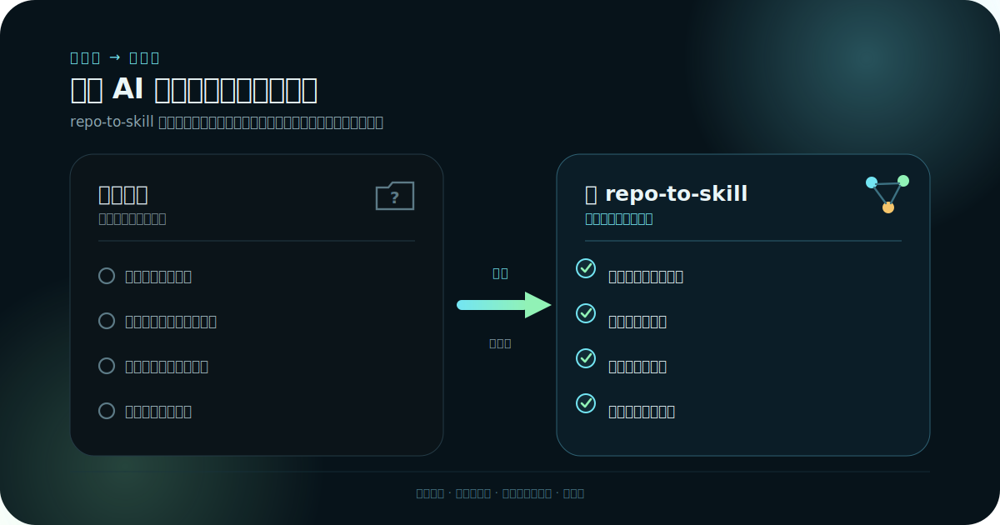
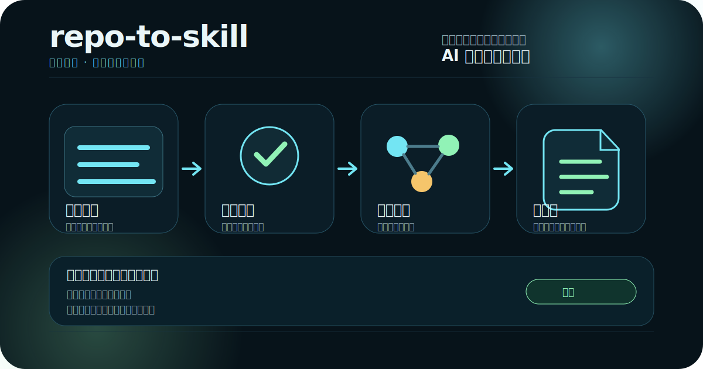

# repo-to-skill

[English](README.md) | [简体中文](README.zh-CN.md)

**在 AI 编程代理动手改代码之前，先给它一张仓库地图。**

repo-to-skill 是一个本地优先的 CLI：它读取本地仓库，生成一个独立、可移植的技能包 —— 项目地图、关键模块、模块关系、任务入口和验证建议，让代理一开始就有方向，而不是盲猜。



[](LICENSE)
[](pyproject.toml)
[](https://github.com/zhangguiping-xydt/repo-to-skill/releases/latest)

- **本地优先** —— 源码不出本机，不调用远程服务。
- **非侵入** —— 不修改目标仓库。
- **确定性** —— 只做静态分析，核心不依赖 LLM 或向量库。
- **大规模验证** —— 已在 4,459 个文件、约 94 万扫描行的大型仓库上验证。

```bash
pip install -e .
repo-to-skill compose ../my-app --output ../my-app-skill
```

## 项目概览



repo-to-skill 面向本地扫描场景：它读取你机器上的目标仓库，把分析产物和生成的技能包写到你指定的目录，并且不会上传源码。它不需要远程数据库，也不默认使用向量数据库；未来可以把向量索引作为可选扩展探索，但它不是当前 MVP 的依赖。

## 生成内容

repo-to-skill 只读分析目标仓库，不修改目标仓库；随后生成一个独立的技能包，供 AI 编程代理审查和导入：

- `SKILL.md`：给人和代理看的项目说明。
- `manifest.yaml`：技能包元信息和安全边界。
- `references/project-map.md`：模块、代表路径、模块关系、任务入口和验证建议。
- `references/capability-graph.md`：仓库能力图谱。
- `references/skill-spec.md`：技能规格说明。
- `references/confidence-report.md`：能力证据与验证说明。
- `scripts/inspect_repo.py`：只读辅助脚本；生成的辅助脚本不会启动 shell 命令。

分析产物链包括 `scan.json`、`profile.json`、`capability_evidence.json`、`capability_graph.json`、`skill_spec.yaml`、`verification_report.json` 和 `confidence-report.md`。

## 图文与视频演示

发布视频源文件位于 [`designs/repo-to-skill-launch`](designs/repo-to-skill-launch/)。大型渲染视频不直接提交到源码历史，而是作为 GitHub Release 附件发布。

- [观看发布视频](https://github.com/zhangguiping-xydt/repo-to-skill/releases/download/v0.1.0/repo-to-skill-launch.mp4)
- [打开 Release 页面](https://github.com/zhangguiping-xydt/repo-to-skill/releases/tag/v0.1.0)

## 安装

从源码目录安装：

```bash
python -m pip install -e .
repo-to-skill --help
```

开发检查：

```bash
python -m pip install -e .[dev]
python -m pytest
```

## 快速开始

使用内置小示例体验完整本地流程：

```bash
repo-to-skill doctor
repo-to-skill analyze ./examples/tiny-python-app --output ./.runs/tiny-python
repo-to-skill generate ./examples/tiny-python-app --analysis ./.runs/tiny-python --output ./.runs/tiny-python-skill
repo-to-skill validate ./.runs/tiny-python-skill
repo-to-skill compose ./examples/tiny-python-app --output ./.runs/tiny-python-composed-skill --workdir ./.runs/tiny-python-compose
repo-to-skill eval --case tiny-python
```

## 分析你自己的仓库

请把分析输出和技能包输出放在目标仓库之外：

```bash
mkdir -p ../repo-to-skill-runs
repo-to-skill compose ../my-app \
  --workdir ../repo-to-skill-runs/my-app-analysis \
  --output ../repo-to-skill-runs/my-app-skill
repo-to-skill validate ../repo-to-skill-runs/my-app-skill
```

在把生成的技能包导入任何 AI 编程代理环境之前，请先审查 `SKILL.md`、`manifest.yaml` 和 `references/confidence-report.md`。

## 命令

- `doctor`：只检查本地 Python 和包环境。
- `analyze`：执行本地扫描并写入分析产物链。
- `generate`：把完整分析产物链转换成技能包目录。
- `validate`：检查生成技能包的结构和安全边界。
- `compose`：在本地串联 analyze -> generate -> validate，不做运行时注册。
- `eval`：运行确定性的本地评估用例，例如内置的 `tiny-python`。

## 安全模型

repo-to-skill 不修改目标仓库。analyze/generate 的输出必须位于目标仓库之外，这样生成产物不会意外变成目标仓库源码改动。

生成的辅助脚本是只读的：无网络、无依赖安装，并且不会启动 shell 命令。它们只检查已提交文件并生成可人工审查的参考资料。

## 支持规模与限制

repo-to-skill 面向小型到大型本地仓库。它已在一个大型企业仓库上验证：有效扫描文件 4,459 个，扫描总行数约 94 万行，源码行约 56.9 万行。

当前没有总行数硬上限。实际耗时取决于文件数量、磁盘速度以及仓库中生成内容的比例。扫描器会跳过二进制文件、符号链接、敏感文件、生成产物、依赖目录、本地运行产物，以及单个超过 1 MiB 的文件。

## 兼容性

生成包刻意保持工具中立。不同工具可以直接读取 Markdown 参考资料，也可以使用命令式适配器，或实现原生包适配。详见 [Compatibility](docs/compatibility.md) 和 [Adapters](adapters/README.md) 中的 adapter contract。

## 运行时边界

开源版本只采用仓库知识沉淀相关的思路：产物链、能力证据、能力图谱、技能规格和验证报告。它不连接 CapabilityRegistry/FastAPI/runtime hot registration，也不是 multi-agent-dev external_skills hot loading。

## 更多文档

- [Architecture](docs/architecture.md)
- [Security](docs/security.md)
- [Skill output format](docs/skill-output-format.md)
- [Compatibility](docs/compatibility.md)
- [Adapters](adapters/README.md)
- [Evals](docs/evals.md)

## 协议与来源声明

repo-to-skill 使用 Apache License 2.0。你可以在该协议下使用、修改和分发。

如果再分发本项目或其衍生作品，请保留 `LICENSE` 和 `NOTICE`，并声明 repo-to-skill 项目为原始来源。
