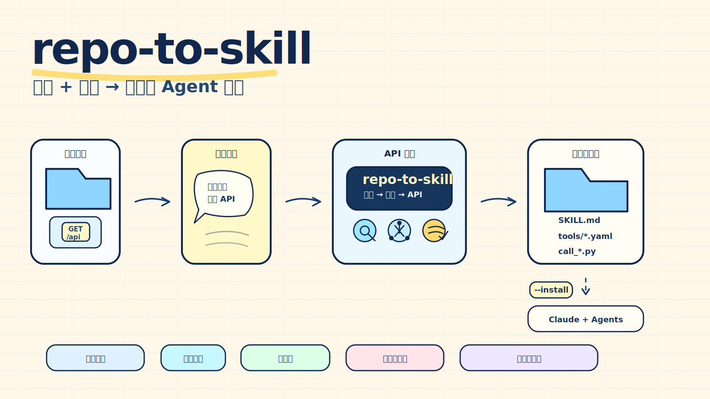

# starry-agent

[English](README.md) | [简体中文](README.zh-CN.md)

**个人 agent 产物集合：skill、工具、agent 产品。**

`starry-agent` 汇集作者开发的面向 agent 的产物：可调用 skill、生成或支撑 skill 的工具、独立的 agent 产品。每个产物放在自己的子目录里，可独立使用。

| 路径 | 类型 | 说明 |
|------|------|------|
| [`skills/repo-to-skill/`](skills/repo-to-skill/) | Skill | 包装 `repo-to-skill` CLI 的 skill，供 agent 调起。 |
| [`repo_to_skill/`](repo_to_skill/) + [`pyproject.toml`](pyproject.toml) | 工具 + 库 | `repo-to-skill` CLI：把本地仓库和用户目标变成可安装的可调用 skill。 |
| [`docs/`](docs/) | 文档 | 中英文工作原理、技能解析、架构、安全。 |

以后新增的产物会作为新的顶层子目录出现（例如 `agents/<name>/` 下的独立 agent 产品）。

---

## repo-to-skill

**给它一个仓库和一个用户目标，它会找到合适的 API，并把它们生成可调用的 agent skill。**



repo-to-skill 帮助编程代理复用已有系统能力，而不是重新实现一遍。它**直接从源码读取本地仓库——无需 API 文档或 OpenAPI 规范**，识别可调用的 HTTP 接口，根据用户目标选择相关 API，并生成一个独立、可安装的 skill 包：包含工具契约、安全调用脚本和源码级溯源说明。

- **源码而非文档** —— 通过静态分析从源码逆向出可调用接口，因此对没有任何 API 文档的遗留系统同样有效。
- **目标驱动** —— 从用户目标开始，而不是手工挑接口。
- **可调用** —— 生成的 skill 包含工具契约和 `scripts/call_*.py`，可对接真实 HTTP 系统。
- **可安装** —— `--install` 直接把生成的 skill 放进 `~/.claude/skills` 和 `~/.agents/skills`，跨 agent 即装即用。
- **不侵入目标仓库** —— 只读取目标仓库，把产物写到外部目录，不修改目标仓库。
- **可审计** —— 每个入选 API 都有 route、handler、业务方法、字段契约、得分和源码依据。

## 它有何不同

给 agent 添加新 skill 的常见做法，要么是**手工编写**，要么是从 **API 文档 / OpenAPI 规范**生成。repo-to-skill 则从**源码**出发：静态识别一个代码库已经暴露的 HTTP 接口，把选中的接口变成可调用的 skill——每个字段都能追溯回源码。这让它正好能用在那些缺少文档的系统上：较老的内部与企业服务。

## 为什么需要它

很多组织的核心能力已经存在于旧系统里：人力流程、财务审批、内部运营、客服工具、排班系统、报表接口等。编程代理可以读代码，但读懂代码不等于可以安全复用线上系统行为。

repo-to-skill 把这些已有接口变成可调用的 agent skill：

```text
本地仓库 + 用户目标
  -> 静态分析
  -> 可调用 API 识别
  -> 按目标选择接口
  -> 一个聚焦的组合 skill
  -> 通过校验的工具契约和默认 dry-run 调用脚本
```

生成结果不是对原仓库的补丁，而是一个独立 skill 包，后续 agent 可以审阅、导入和调用。

## 它会生成什么

repo-to-skill 支持生成两类 skill。

### 1. 仓库地图 skill

给编程代理使用的只读理解包：

- `SKILL.md` —— 面向人的项目说明。
- `manifest.yaml` —— 元数据和安全边界。
- `references/project-map.md` —— 模块、代表性路径、模块关系、任务入口和验证建议。
- `references/capability-graph.md` —— 能力图。
- `references/skill-spec.md` —— 生成的 skill 规格。
- `references/confidence-report.md` —— 证据和验证说明。
- `scripts/inspect_repo.py` —— 只读辅助脚本。

### 2. Callable bundle skill

围绕一个用户目标封装多个真实 HTTP API 的组合 skill：

- `SKILL.md` —— 什么时候使用这个 bundle，以及包含哪些工具。
- `manifest.yaml` —— `kind: callable-bundle`、选择摘要和安全边界。
- `tools/*.tool.yaml` —— 每个入选 API 一个机器可读工具契约。
- `scripts/call_*.py` —— 每个入选 API 一个安全调用脚本。
- `references/capability-selection.md` —— 为什么这些 API 被选中。
- `references/capability-source.md` —— route、handler、业务方法、输入字段、输出字段和源码依据。

生成的 caller 默认只预览请求。只有用户设置 endpoint 环境变量并传入 `--execute` 时，才会真正发起请求。Token 从环境变量读取，预览输出中会脱敏。

## 快速开始

从源码安装：

```bash
python -m pip install -e .
repo-to-skill --help
```

根据仓库和目标生成 callable 组合 skill，并直接安装供 agent 使用：

```bash
repo-to-skill analyze ./my-legacy-system --output ./.runs/my-system-analysis

repo-to-skill generate ./my-legacy-system \
  --analysis ./.runs/my-system-analysis \
  --output ./.runs/my-system-skill \
  --mode callable-bundle \
  --need "employee onboarding and job transfer workflows" \
  --max-interfaces 12 \
  --install
```

加上 `--install`，通过校验的 bundle 会被拷贝进 `~/.claude/skills/` 和 `~/.agents/skills/`，编程代理可以立刻识别使用。不加 `--install` 则只在 `--output` 下生成可审阅的 skill 包。

或生成只读仓库地图 skill：

```bash
repo-to-skill compose ./examples/tiny-python-app \
  --workdir ./.runs/tiny-python-analysis \
  --output ./.runs/tiny-python-skill
```

校验生成的 bundle：

```bash
repo-to-skill validate ./.runs/my-system-skill/<bundle-name>
```

## Agent skill 工作流

repo-to-skill 本身可以作为编程代理里的 skill-builder 使用：

1. 对目标仓库运行 `analyze`。
2. 读取 `callable_capabilities.json`。
3. 把用户目标转换成一小组相关 interface slugs。
4. 写入选择文件：

   ```json
   {
     "need_summary": "Generate a callable skill for employee onboarding and job transfer workflows.",
     "selected_slugs": ["employee-entry", "job-transfer", "position-change"],
     "selection_source": "agentic"
   }
   ```

5. 基于已验证的选择生成 bundle：

   ```bash
   repo-to-skill generate ./my-legacy-system \
     --analysis ./.runs/my-system-analysis \
     --output ./.runs/my-system-skill \
     --mode callable-bundle \
     --selection-json ./.runs/selection.json
   ```

CLI 会继续校验每个 slug。如果 agent 提供的 slug 不存在于 `callable_capabilities.json`，生成会失败，而不是凭空编造工具。

## 命令

- `doctor` 检查本地 Python/package 环境。
- `analyze` 扫描本地仓库并写出分析产物。
- `generate` 把分析产物生成 skill 目录。
- `validate` 检查生成 skill 的结构和安全边界。
- `compose` 对只读仓库地图 skill 执行 analyze -> generate -> validate。
- `eval` 运行确定性的本地 eval case。

## 安全模型

repo-to-skill 不修改目标仓库。建议把 analysis 和 skill 输出目录放在目标仓库外部，避免生成产物被误当成源码变更。

只读仓库地图 helper 不使用网络。Callable bundle helper 可以调用真实 HTTP 系统，但必须显式配置 endpoint 并传入 `--execute`。它们不安装依赖、不执行 shell 命令，也不写目标仓库。

## 规模和限制

repo-to-skill 面向小到大的本地仓库。它已经在一个大型企业仓库上验证过：扫描 4,459 个文件、约 940k 扫描行、约 569k 源码行。

它没有硬性的总行数上限。运行耗时取决于文件数量、磁盘速度和生成内容。扫描器会跳过二进制文件、符号链接、敏感文件、生成产物、依赖目录、本地运行产物，以及单文件大于 1 MiB 的文件。

## 兼容性

生成包保持 vendor-neutral。不同编程代理工具可以直接读取 Markdown reference，通过命令适配器使用，或实现原生包适配器。详见 [Compatibility](docs/compatibility.md) 和 [Adapters](adapters/README.md)。

## 更多文档

- [工作原理](docs/how-it-works.zh-CN.md)
- [技能详细解析](docs/skill-reference.zh-CN.md)
- [Architecture](docs/architecture.md)（英文）
- [Security](docs/security.md)（英文）
- [Skill output format](docs/skill-output-format.md)（英文）
- [Compatibility](docs/compatibility.md)（英文）
- [Adapters](adapters/README.md)（英文）
- [Evals](docs/evals.md)（英文）

英文版工作原理与技能解析：[How it works](docs/how-it-works.md) / [Skill reference](docs/skill-reference.md)。

## 许可证与署名

repo-to-skill 使用 Apache License 2.0。你可以在该许可证下使用、修改和分发它。

重新分发本项目或其衍生作品时，请保留 `LICENSE` 和 `NOTICE`，并注明 repo-to-skill 项目是原始来源。
